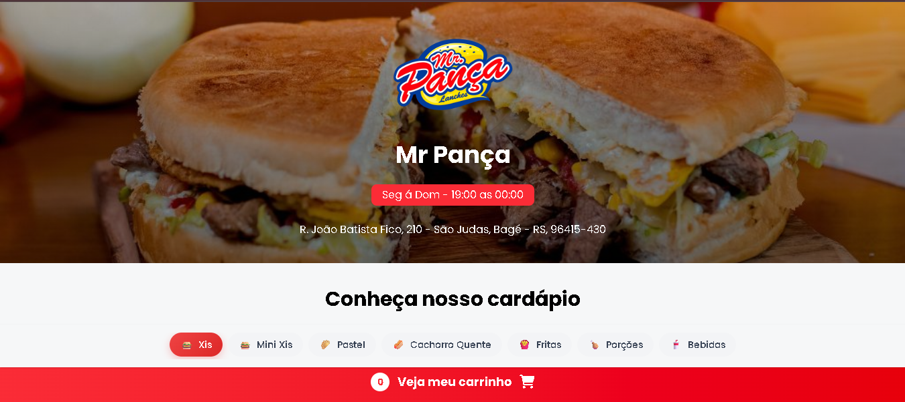
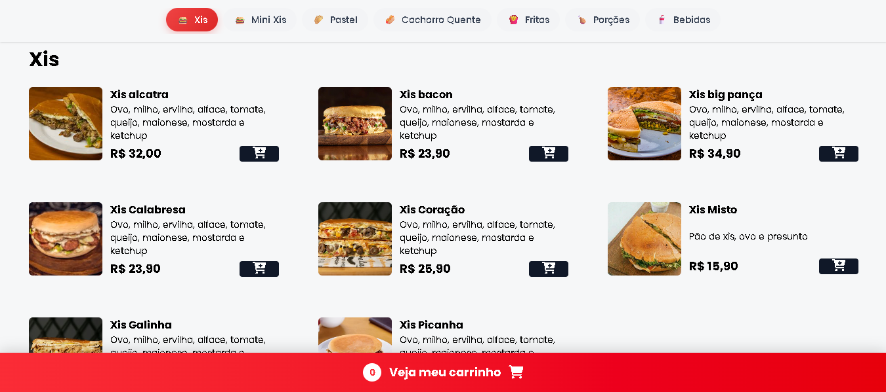
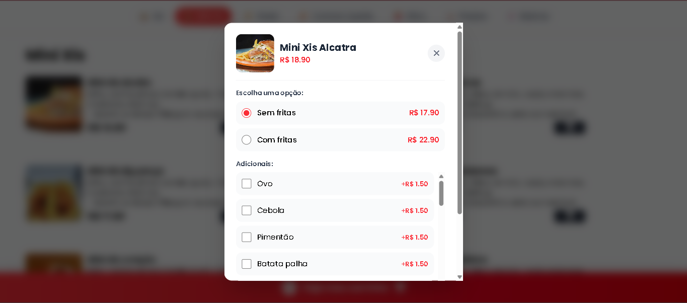
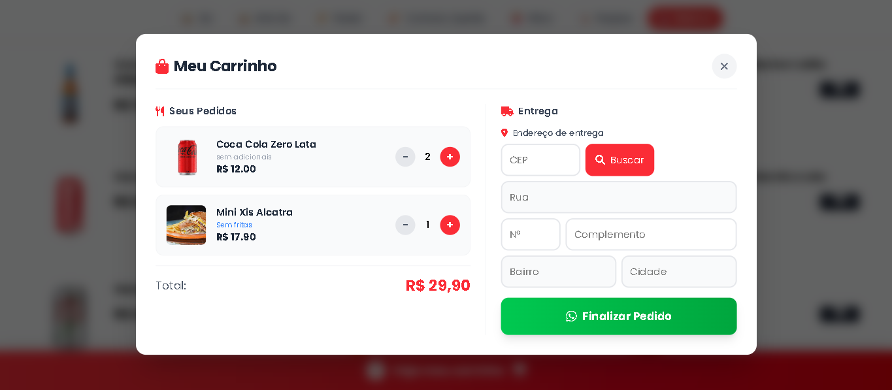

# Cardápio Digital

Sistema de cardápio digital para lanchonete com carrinho de compras e integração com WhatsApp.

## Funcionalidades

- Cardápio completo com categorias (Xis, Mini Xis, Pastel, Cachorro Quente, Fritas, Porções, Bebidas)
- Filtros de navegação rápida por categoria
- Sistema de adicionais personalizáveis por produto
- Carrinho de compras com controle de quantidade
- Busca automática de endereço por CEP (ViaCEP)
- Envio de pedido direto para WhatsApp
- Layout responsivo (Desktop e Mobile)
- Verificação de horário de funcionamento

## Screenshots

### Tela Inicial

### Opções de Personalização

### Adição de Complementos

### Carrinho de Compras

## Tecnologias

- HTML5
- CSS3 (Tailwind CSS)
- JavaScript
- Font Awesome 6
- API ViaCEP
- API WhatsApp

---

### Transforme a experiência dos seus clientes!

Um cardápio digital moderno e intuitivo faz toda a diferença. Seus clientes pedem com facilidade, você recebe direto no WhatsApp.

**Simples. Rápido. Eficiente.**

